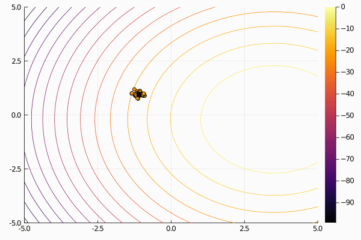

# EvolutionaryStrategies.jl

[](https://travis-ci.org/d9w/EvolutionaryStrategies.jl) [](https://coveralls.io/r/d9w/EvolutionaryStrategies.jl?branch=master) [](https://codecov.io/gh/d9w/EvolutionaryStrategies.jl)

Julia implementations of Natural Evolutionary Strategies and CMA-ES, based on
[Cambrian.jl](https://github.com/d9w/Cambrian.jl)



## Installation

`EvolutionaryStrategies.jl` can be installed through the Julia package manager:

```julia
pkg> add EvolutionaryStrategies
```

Tests are also provided:

```julia
pkg> test EvolutionaryStrategies
```

## Usage

The function to optimize must first be defined:

```julia
fitness(i::Individual) = -sum(i.genes .^ 2)
```

<div class="alert alert-info">
Note that Cambrian by default **maximizes** objective fitness, which is common
in neuroevolution and genetic programming. Evolutionary Strategies often
*minimize* objective functions, but for coherence with Cambrian,
`EvolutionaryStrategies.jl` maximizes. For objective fitness definitions, you
must negate fitness if aiming to minimize, as demonstrated above.
</div>

Then, create and run the desired ES:

```julia
cfg = get_config("cfg/cma-es.yaml")
es = CMAES(cfg, fitness)
run!(es)
```

Examples can be found in the `scripts/` directory.

## Similar packages

Other Evolutionary Strategies resources, notably other Julia packages:

+ [pycma](https://github.com/CMA-ES/pycma)
+ [CMAEvolutionStrategy.jl](https://github.com/jbrea/CMAEvolutionStrategy.jl)
+ [NaturalES.jl](https://github.com/francescoalemanno/NaturalES.jl)
+ [BlackBoxOptim.jl](https://github.com/robertfeldt/BlackBoxOptim.jl)

